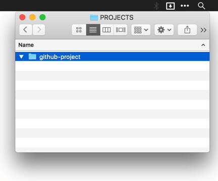

# touch README.md
A **Dropzone 3** version of the <kbd>touch README.md</kbd> command. Drag a folder into this **Dropzone 3** action to create an empty `README.md` file. 

<h2>Install</h2>

1. Download <kbd>touch Markdown README.dzbundle.zip</kbd> and unzip
2. Double-click the unzipped file